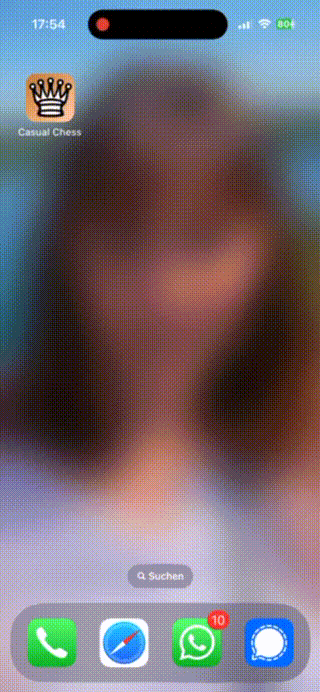
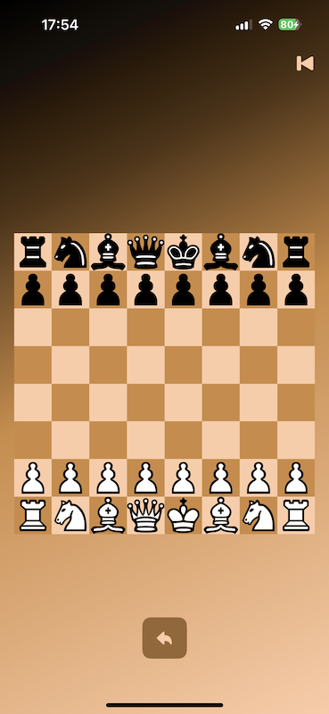
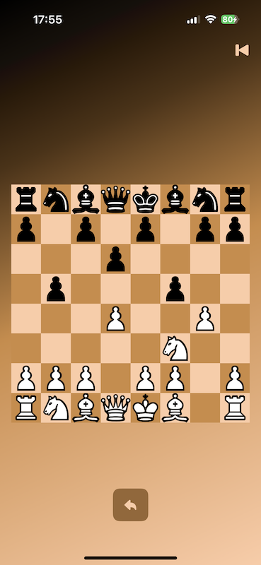

# Casual Chess



## Overview

_Casual Chess_ is a local chess client that can be played with a friend on iPhone, iPad, Apple Vision or Mac with Catalyst.
Just press rewind when a player is not happy with the outcome of a move.

## Technologies

_Xcode_ | _Swift_ | _SwiftUI_

## Images

 

## Usage

### Prerequisites

- Xcode 14 or newer
- Installed iOS 14+ emulator, MacOS with Catalyst (Apple Silicon) or connected iOS 14+ device

### Installation

1. Clone this repository:
   ```bash
   git clone https://github.com/chris-prenissl/casual_chess.git
   ```
2. Open the project with Xcode:
   ```bash
   cd casual_chess
   open Casual\ Chess.xcodeproj
   ```
3. Choose device and press play

## License

This project is licensed under the MIT License - see the [LICENSE](LICENSE.md) file for details.
